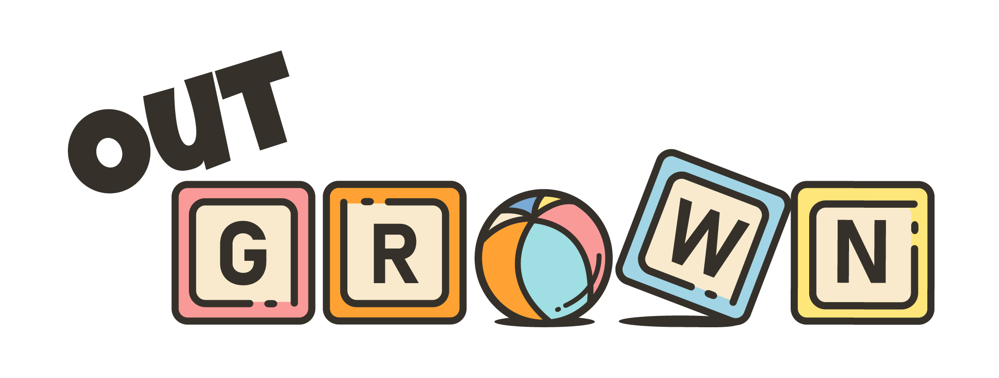
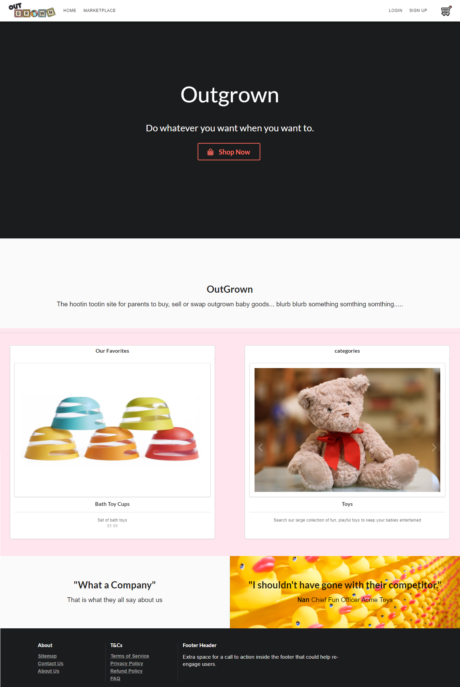
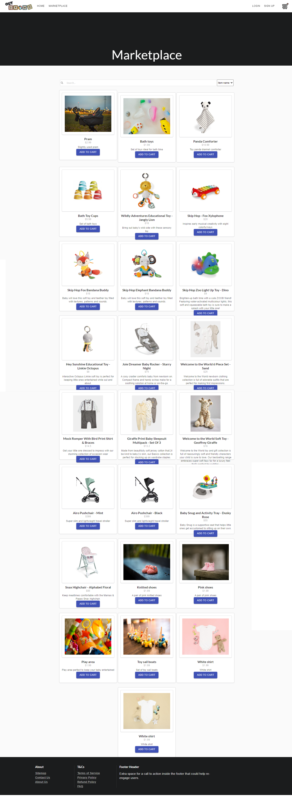
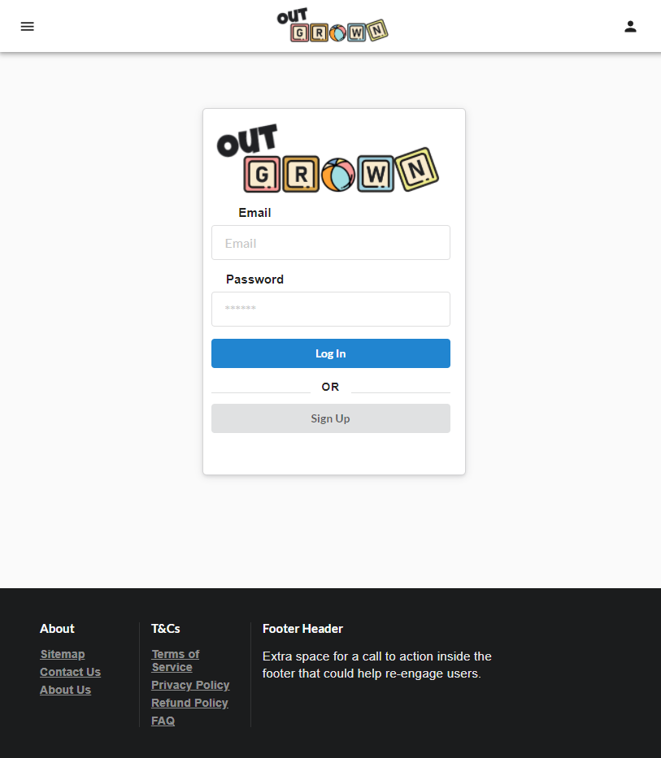

# Outgrown 

## Table of contents
- [Intro](#intro)
- [Usage](#usage)
- [Technologies](#technologies)
- [Screenshots](#screenshots)
- [Contributing](#contributing)
- [Deployment](#deployment)
- [License](#license)

## Intro

Outgrown is a fresh take on the traditional e-commerce app, created to ease the burden on parents of young children through the trading and selling of kids' clothing, toys, furniture and other paraphernalia that is often essential but prohibitively expensive for first-time parents. Our app promotes recycling and rehoming of essential children's items. Great for parents, great for kids. 

## Usage

To install and use this app, first clone this repository and run `npm install` to install the necessary packages. You will then need to build and seed the project with `npm run build` and `npm run seed`. Finally, to run the app use `npm run start` or `npm run developer`, if you wish to run in a development environment. 

## Technologies

- This app runs inside a Node.js run-time environment, using an Express.js server and GraphQL API
- Data is stored in a Mongo database and accessed via the Mongoose ODM
- The front-end is built with React
- CSS styling and components are provided by Semantic UI and Material UI
- JWTs (JSON Web Tokens) were used for authenticating users and Bcrypt for the hashing of passwords
- Integration with the Stripe payment platform for purchases
- Hosted with Heroku

## Screenshots

## Contributing 

- [Freddie](https://github.com/freddieb12345) 
- [Jack](https://github.com/bytemybits)
- [Wael](https://github.com/wa20)

## Deployment

You can find our deployed app [here](https://outgrown-app.herokuapp.com/)

## License

Licensed under the [MIT](https://opensource.org/licenses/MIT) license.